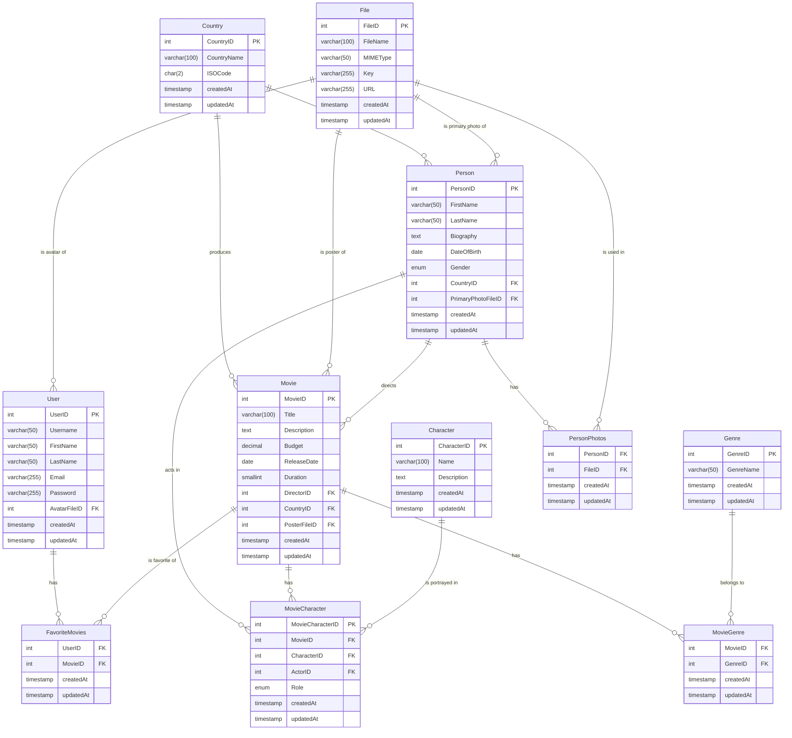

# movie-app-db-sql

## Notes

* Role attribute is in CharacterMovies table. It makes more sense for this schema to put it in here, rather than in Character table: in one movie a character can play leading role and in another play supporting role. So by doing this, I can avoid creating duplicate characters with different role values.
